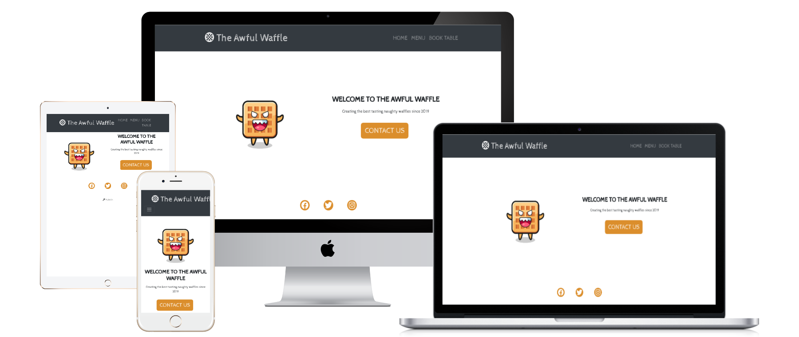

# The Aweful Waffle

## REFERENCES

- https://www.digitalocean.com/community/tutorials/how-to-use-flask-sqlalchemy-to-interact-with-databases-in-a-flask-application#declaring-the-table
- https://getbootstrap.com/docs/5.2/getting-started/introduction/
